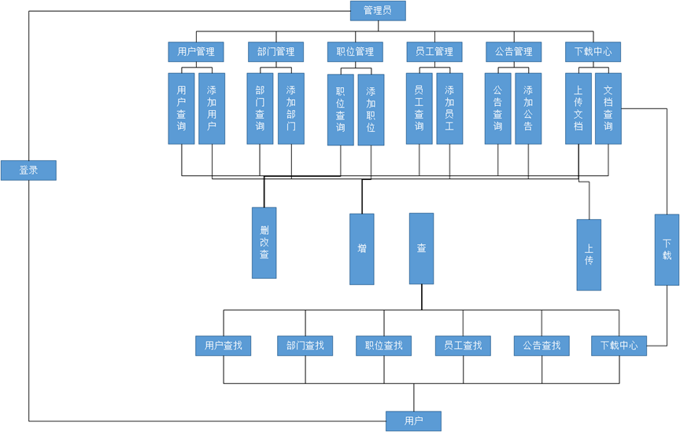
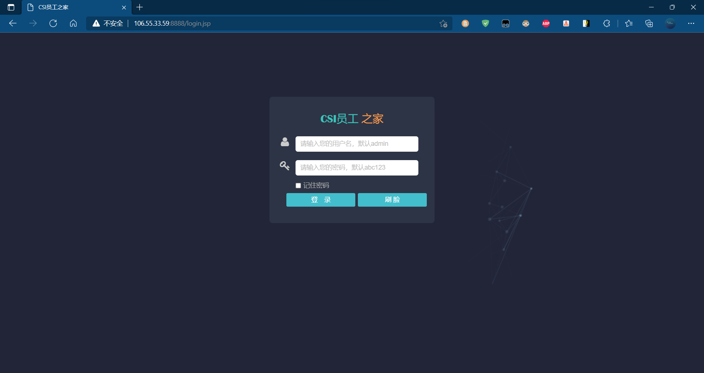
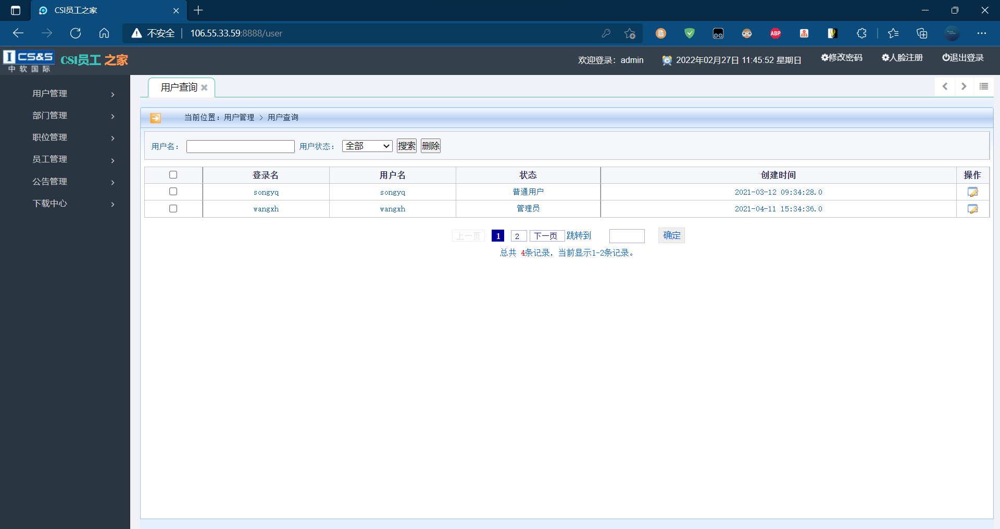

# CSI 员工之家中软国际/华为鲲鹏 实习项目

## 背景说明

CSI员工之家与人事管理系统其实有很多共同之处是办公信息自动化建设中最常见的项目，几乎每个OA系统中都需要。
该项目应包含用户管理、部门管理、职位管理、员工管理、公告管理、下载中心等多个模块；页面应使用JQuery框架完成动态功能；用户管理、部门管理等模块应包含项目开发中常用的增删改查动作，下载中心应包含文件上传、下载等功能，登录页面除了常规登录之外，还应加入人工智能人脸识别领域中的人脸对比登录功能。

## 项目特点

- 项目后端为 Servlet 框架，前端为 JSP、JQuery，开发语言主要为 Java。
- 项目部署环境为： openEuler、数据库为 openGauss
- 项目主要目的是：熟悉 openEuler 环境及其使用，了解 openGauss 数据库的使用。

> 初次使用需要在 src>util>DBHelper 中修改数据库相关配置。部署到 Tomcat 即可。

> 在线体验地址：http://106.55.33.59:8888/

 
## **业务功能**

| 模块描述 | 功能描述                                                     |
| -------- | --------------------------------------------------------- |
| 登录     | 可进行用户名密码登录、可选择是否记住密码、可进行刷脸登录     |
| 用户管理 | 包含用户查询和添加用户两部分 管理员在用户查询里可进行删改查操作，普通用户只能进行查询 管理员可以进行添加用户功能操作，普通用户不可以访问操作此功能 |
| 部门管理 | 包含部门查询和添加部门两部分 管理员在部门查询里可进行删改查操作，普通用户只能进行查询 管理员可以进行添加部门功能操作，普通用户不可以访问操作此功能 |
| 职位管理 | 包含职位查询和添加职位两部分 管理员在职位查询里可进行删改查操作，普通用户只能进行查询 管理员可以进行添加职位功能操作，普通用户不可以访问操作此功能 |
| 员工管理 | 包含员工查询和添加员工两部分 管理员在员工查询里可进行删改查操作，普通用户只能进行查询 管理员可以进行添加员工功能操作，普通用户不可以访问操作此功能 |
| 公告管理 | 包含公告查询和添加公告两部分 管理员在公告查询里可进行删改查操作，普通用户只能进行查询 管理员可以进行添加公告功能操作，普通用户不可以访问操作此功能 |
| 下载中心 | 包含文档查询和上传文档两部分 管理员在文档查询里可进行删改查下载操作，普通用户只能进行查询下载 管理员可以进行上传文档功能操作，普通用户不可以访问操作此功能 |
| 修改密码 | 对密码进行修改                                               |
| 人脸注册 | 刷脸注册，只有注册人脸才能在登录中进行刷脸登录               |

## 项目展示

